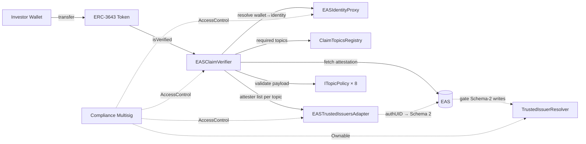
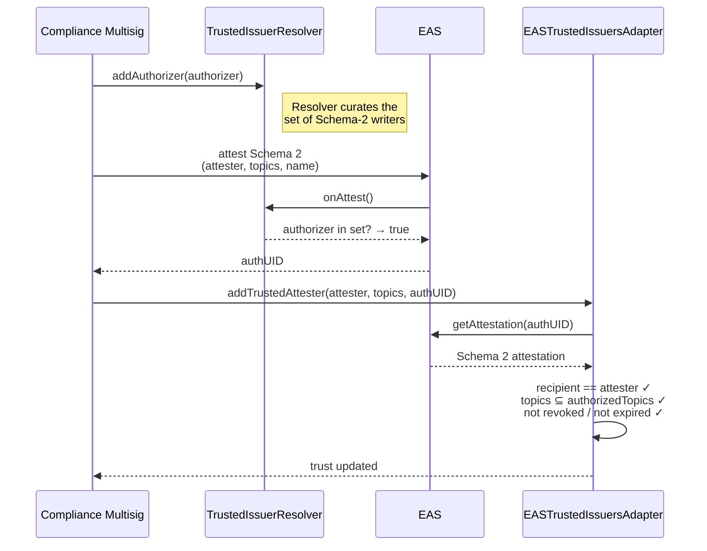

# Shibui

**An attestation retrieval adapter for ERC-3643 security tokens.** Shibui lets an ERC-3643 token answer *"is this wallet allowed to hold this security right now?"* from attestations issued on the [Ethereum Attestation Service](https://attest.org/) by any trusted KYC/AML/accreditation provider — without deploying a per-user identity contract or coupling the token to a single provider ecosystem.

> An open-source project by the [Enterprise Ethereum Alliance](https://entethalliance.org)

---

## Why Shibui exists

ERC-3643 (the security token standard) mandates an on-chain identity check on every transfer. The reference implementation (ONCHAINID) requires each investor to deploy their own identity contract, pins the token to a specific KYC-provider ecosystem, and offers no on-chain enforcement of the attestation's *contents* — only its existence.

That model breaks down for issuers who need any of:

- **Multiple KYC providers** for the same token (geographic, redundancy, or suitability).
- **Semantic enforcement** — blocking a wallet whose KYC is pending, expired, or whose jurisdiction is on a sanctions list.
- **An auditable control plane** where compliance staff, not engineers, can rotate trusted providers.
- **An evidence trail** that ties a verification decision back to the underlying KYC file a regulator will ask for.

Shibui addresses those needs by replacing the ONCHAINID identity layer with a small stack of contracts that read EAS attestations, enforce the payload against a configurable policy per topic, and gate trust changes with a cryptographic audit trail.

## What it does

Shibui's one public entry point is:

```solidity
EASClaimVerifier.isVerified(address wallet) → bool
```

For a transfer to be allowed, the ERC-3643 token contract calls this from its compliance hook. Shibui returns `true` only when, for **every** claim topic the token requires:

- The investor's identity has an EAS attestation registered for that topic, from an attester the issuer currently trusts for that topic.
- The attestation is live (not revoked, not past its EAS-level `expirationTime`, not past its payload-level `expirationTimestamp`).
- The attestation's decoded payload satisfies the topic's policy — e.g. `kycStatus == VERIFIED`, `countryCode` in the allow-list, `accreditationType` in the allowed set, `sanctionsStatus == CLEAR`.

If any required topic fails any check, `isVerified` returns `false` and the transfer is blocked by the token contract.

## What it does *not* do

Shibui is deliberately narrow. The following remain the responsibility of the ERC-3643 **token contract** or off-chain operational tooling:

| Primitive | Where it lives |
|---|---|
| Forced transfer (court orders) | ERC-3643 token |
| Freeze / partial freeze (sanctions) | ERC-3643 token |
| Lost-key recovery | ERC-3643 token `recoveryAddress` flow |
| Lock-ups, per-investor caps, ownership limits | ERC-3643 compliance modules |
| Cross-chain attestation canonicity | Per-chain — re-attest per chain |
| Off-chain / privacy-preserving attestation verification | Not supported |
| Tax withholding, FATCA / CRS reporting | Off-chain |

Revoking a Shibui attestation blocks *future* transfers to/from the wallet. It does not move, freeze, or recover tokens already held. See [`docs/architecture/enforcement-boundary.md`](docs/architecture/enforcement-boundary.md).

---

## Schemas, claim topics, and policies

The canonical source of truth for Shibui's live schema strings is [`script/RegisterSchemas.s.sol`](script/RegisterSchemas.s.sol). [`docs/schemas/schema-definitions.md`](docs/schemas/schema-definitions.md) expands those strings with field semantics, enum values, encoding examples, and workflow notes.

Shibui registers **two** EAS schemas today:

| # | Name | Canonical schema string source | Used by |
|---:|---|---|---|
| 1 | Investor Eligibility | `RegisterSchemas.s.sol` | All eight `ITopicPolicy` modules |
| 2 | Issuer Authorization | `RegisterSchemas.s.sol` | `EASTrustedIssuersAdapter` + `TrustedIssuerResolver` |

### Schema 1 — Investor Eligibility

This is the single canonical payload every production claim topic decodes.

- **Field count:** 10 ABI fields
- **Schema string:**

```text
address identity,uint8 kycStatus,uint8 amlStatus,uint8 sanctionsStatus,uint8 sourceOfFundsStatus,uint8 accreditationType,uint16 countryCode,uint64 expirationTimestamp,bytes32 evidenceHash,uint8 verificationMethod
```

| # | Field | Type | Notes |
|---:|---|---|---|
| 1 | `identity` | `address` | ERC-3643 identity address |
| 2 | `kycStatus` | `uint8` | Used by `KYCStatusPolicy` |
| 3 | `amlStatus` | `uint8` | Used by `AMLPolicy` |
| 4 | `sanctionsStatus` | `uint8` | Used by `SanctionsPolicy` |
| 5 | `sourceOfFundsStatus` | `uint8` | Used by `SourceOfFundsPolicy` |
| 6 | `accreditationType` | `uint8` | Used by accreditation / professional / institutional policies |
| 7 | `countryCode` | `uint16` | ISO 3166-1 numeric |
| 8 | `expirationTimestamp` | `uint64` | Payload-level validity deadline |
| 9 | `evidenceHash` | `bytes32` | Commitment to off-chain evidence |
| 10 | `verificationMethod` | `uint8` | Provenance / review method |

Topic IDs follow the ONCHAINID claim-topic convention commonly used in ERC-3643 deployments; ERC-3643 itself does not prescribe specific numeric topic IDs. Shibui implements a subset of those topic IDs and maps each one to a policy module that validates the relevant fields of the shared Investor Eligibility schema.

### ONCHAINID-style claim topic → Shibui policy mapping

| Topic ID | ONCHAINID-style meaning | Shibui policy | Predicate |
|---:|---|---|---|
| 1 | KYC | `KYCStatusPolicy` | `kycStatus == VERIFIED` |
| 2 | AML | `AMLPolicy` | `amlStatus == CLEAR` |
| 3 | COUNTRY | `CountryAllowListPolicy` | `countryCode` in allow-list or block-list mode |
| 7 | ACCREDITATION | `AccreditationPolicy` | `accreditationType` in admin-configured allow-set |
| 9 | PROFESSIONAL | `ProfessionalInvestorPolicy` | any non-zero accreditation type |
| 10 | INSTITUTIONAL | `InstitutionalInvestorPolicy` | `accreditationType == INSTITUTIONAL` |
| 13 | SANCTIONS_CHECK | `SanctionsPolicy` | `sanctionsStatus == CLEAR` |
| 14 | SOURCE_OF_FUNDS | `SourceOfFundsPolicy` | `sourceOfFundsStatus == VERIFIED` |

### Schema 2 — Issuer Authorization

This is the attestation schema that backs trusted-attester changes.

- **Field count:** 3 ABI fields
- **Schema string:**

```text
address issuerAddress,uint256[] authorizedTopics,string issuerName
```

| # | Field | Type | Notes |
|---:|---|---|---|
| 1 | `issuerAddress` | `address` | Must match the attester being authorized |
| 2 | `authorizedTopics` | `uint256[]` | Must cover the requested topic set |
| 3 | `issuerName` | `string` | Human-readable display name |

Registration parameters for Schema 2:
- resolver = `TrustedIssuerResolver`
- revocable = `true`
- EAS expiration = optional

For expanded field semantics, enum values, and encoding examples, see [`docs/schemas/schema-definitions.md`](docs/schemas/schema-definitions.md).

## Architecture

### Runtime wiring



### Verification flow

For a single `isVerified(wallet)` call:

1. **Resolve the investor's identity.** `EASIdentityProxy.getIdentity(wallet)` returns the identity address. The proxy is required — there is no "wallet is its own identity" fallback.
2. **Enumerate required topics** from `ClaimTopicsRegistry.getClaimTopics()`.
3. **For each required topic**, the verifier:
   - Looks up the bound `ITopicPolicy` (e.g. `KYCStatusPolicy` for topic 1). No policy bound → verification reverts with `PolicyNotConfiguredForTopic`.
   - Looks up the bound EAS schema UID.
   - Iterates the topic's trusted-attester list (capped at 5). For each attester, fetches the registered attestation and checks: exists → schema matches → not revoked → not expired → attester still trusted → `policy.validate(attestation)` returns true.
   - Short-circuits to *pass* on the first attester whose attestation clears all checks.
4. **Returns true** only if every required topic was satisfied.

### Trust changes (Schema-2 gate)

Adding a trusted attester is a two-step, cryptographically signed process:



Every trusted-attester change references a live EAS attestation under Schema 2 (Issuer Authorization). That attestation is gated by a resolver, so only admin-curated authorizers can write it. The result is an on-chain audit trail: "this provider is trusted for these topics, as attested on-chain by this authorized party at this block."

---

---

## Administration

Three roles, gated by OpenZeppelin `AccessControl`:

| Role | Holder | Can do |
|---|---|---|
| `DEFAULT_ADMIN_ROLE` | **Compliance multisig** | Grant/revoke other roles; authorise UUPS upgrades; set the Issuer Authorization schema UID on the adapter. |
| `OPERATOR_ROLE` | Day-to-day operators | Map topics to schemas, bind topics to policies, add/remove/update trusted attesters. |
| `AGENT_ROLE` | Issuer agents | Bind wallets to investor identities in the identity proxy. |

The production deploy script grants all three to the multisig atomically and renounces the deployer's grants in the same transaction. No timelock — the multisig is the control plane.

---

## Repository layout

```
contracts/
├─ EASClaimVerifier.sol                — main verifier entry point
├─ EASTrustedIssuersAdapter.sol        — Schema-2-gated trusted attester registry
├─ EASIdentityProxy.sol                — wallet ↔ identity binding
├─ compat/                             — Path B compatibility shim
├─ demo/                               — demo ERC-3643 token used by the live app
├─ interfaces/                         — public interfaces
├─ mocks/                              — MockEAS / MockAttester / MockClaimTopicsRegistry
├─ policies/                           — TopicPolicyBase + 8 concrete topic policies
├─ resolvers/                          — TrustedIssuerResolver
└─ upgradeable/                        — UUPS variants of the three core contracts

script/
├─ AddTrustedAttester.s.sol            — CLI helper, requires AUTH_UID
├─ ConfigureBridge.s.sol               — topic/schema/policy wiring
├─ DeployBridge.s.sol                  — non-upgradeable reference deploy
├─ DeployIdentityWrapper.s.sol         — per-identity Path B wrapper
├─ DeployMainnet.s.sol                 — gated production deploy
├─ DeployTestnet.s.sol                 — Sepolia / Base Sepolia deploy
├─ DeployUpgradeable.s.sol             — ERC1967Proxy-fronted UUPS deploy
├─ RegisterSchemas.s.sol               — register Investor Eligibility + Issuer Authorization
└─ SetupPilot.s.sol                    — local anvil pilot setup

test/
├─ helpers/BridgeHarness.sol           — shared harness for full-stack tests
├─ integration/                        — revocation, gas, ERC-3643 token, policy-driven flows
├─ scenarios/                          — investor lifecycle + compliance scenarios
└─ unit/                               — verifier / adapter / proxy / wrapper / upgrade tests

demo/
├─ shibui-app/                         — interactive Sepolia demo app
└─ shibui-static/                      — static positioning / GitHub Pages site
```

---

## Two integration paths

**Path A — pluggable verifier (recommended).** The token's ERC-3643 compliance module calls `EASClaimVerifier.isVerified(wallet)` directly. This gives you payload-aware verification, multi-attester resiliency, and the full admin surface.

**Path B — read-compat shim.** `EASClaimVerifierIdentityWrapper` implements the `IIdentity` / ERC-735 interface backed by EAS attestations, for integrating with a pre-existing ERC-3643 Identity Registry that cannot be modified. It is **not** a drop-in replacement for ONCHAINID:

- Does not implement ERC-734 key management (no `addKey`, no recovery).
- Does not return real attester signatures from `getClaim` (returns empty bytes).
- Does not run topic policies in `isClaimValid` (only checks existence / revocation / expiration).
- Gas profile is not suitable for hot paths without caching.

Use Path A for new deployments. Use Path B only when the Identity Registry cannot be modified and the trade-offs are acceptable.

---

## Quickstart

```bash
forge install
forge build
forge test
```

### Local pilot

```bash
anvil
forge script script/SetupPilot.s.sol:SetupPilot \
  --rpc-url http://127.0.0.1:8545 \
  --broadcast
```

Deploys MockEAS, the full Shibui stack (all 8 policies + resolver + Issuer Authorization authorizer), seeds five investors with Investor Eligibility attestations, and prints `isVerified()` for each.

### Testnet pipeline

```bash
# 1. Deploy contracts + policies + resolver
PRIVATE_KEY=... ADMIN_ADDRESS=0x... \
  forge script script/DeployTestnet.s.sol:DeployTestnet --rpc-url $RPC --broadcast

# 2. Register the two EAS schemas (prints UIDs)
PRIVATE_KEY=... ISSUER_AUTH_RESOLVER=<from step 1> \
  forge script script/RegisterSchemas.s.sol:RegisterSchemas --rpc-url $RPC --broadcast

# 3. Wire schema UIDs, topic-policy bindings, and Schema-2 UID on the adapter
VERIFIER_ADDRESS=... ADAPTER_ADDRESS=... \
INVESTOR_ELIGIBILITY_SCHEMA_UID=0x... \
ISSUER_AUTHORIZATION_SCHEMA_UID=0x... \
KYC_POLICY=0x... AML_POLICY=0x... COUNTRY_POLICY=0x... \
  forge script script/ConfigureBridge.s.sol:ConfigureBridge --rpc-url $RPC --broadcast

# 4. Authorize the authorizer(s) on the resolver, then create a Schema-2 attestation
#    for each KYC provider (off-chain or via cast/EAS SDK), then:
ADAPTER_ADDRESS=... ATTESTER_ADDRESS=0x... TOPICS="1,3,7" AUTH_UID=0x... \
  forge script script/AddTrustedAttester.s.sol:AddTrustedAttester --rpc-url $RPC --broadcast

# 5. Each KYC provider attests investors against the Investor Eligibility schema,
#    then the provider (or an AGENT_ROLE holder) registers the UID via
#    EASClaimVerifier.registerAttestation(identity, topic, uid).
```

### Mainnet

Gated behind `AUDIT_ACKNOWLEDGED=true`; requires an audited deploy and a compliance multisig:

```bash
AUDIT_ACKNOWLEDGED=true \
PRIVATE_KEY=... \
MULTISIG_ADDRESS=0x... \
CLAIM_TOPICS_REGISTRY=0x... \
  forge script script/DeployMainnet.s.sol:DeployMainnet --rpc-url $RPC --broadcast
```

The script transfers all admin roles to the multisig and renounces the deployer's grants in the same broadcast. See [`AUDIT.md`](AUDIT.md) for the launch gate and threat model.

---

## Gas at a glance

| Operation | Gas |
|---|---:|
| `isVerified` — 1 topic | 31,539 |
| `isVerified` — 3 topics | 80,083 |
| `isVerified` — 5 topics | 122,090 |
| `registerAttestation` | 53,393 |
| `addTrustedAttester` (Schema-2 gated) | 201,533 |
| `registerWallet` | 79,029 |

Full report and reproduction instructions in [`docs/gas-benchmarks.md`](docs/gas-benchmarks.md).

---

## Security

- Reproducible local tests: `forge test` against the full Foundry suite.
- Mainnet deploy is gated — the script refuses to broadcast unless `AUDIT_ACKNOWLEDGED=true` is set. See [`AUDIT.md`](AUDIT.md) for the launch gate, threat model, and minimum-required pre-flight checklist.
- Roles, not ownership. All admin actions are role-gated; production uses a compliance multisig as `DEFAULT_ADMIN_ROLE`.

---

## Documentation

- [`docs/architecture/enforcement-boundary.md`](docs/architecture/enforcement-boundary.md) — what Shibui does and does not provide. **Start here if you're integrating.**
- [`docs/architecture/identity-architecture-explained.md`](docs/architecture/identity-architecture-explained.md) — architectural walkthrough.
- [`docs/integration-guide.md`](docs/integration-guide.md) — Path A and Path B step-by-step.
- [`docs/schemas/schema-definitions.md`](docs/schemas/schema-definitions.md) — Investor Eligibility and Issuer Authorization specs.
- [`docs/research/gap-analysis.md`](docs/research/gap-analysis.md) — ONCHAINID vs EAS comparison.
- [`AUDIT.md`](AUDIT.md) — launch gate, threat model, pre-flight checklist.
- [`PRD.md`](PRD.md) — scope and acceptance criteria.

## Live site

- Landing: https://entethalliance.github.io/rnd-rwa-erc3643-eas/
- Identity solutions reference map: https://entethalliance.github.io/rnd-rwa-erc3643-eas/identity-solutions-map.html

## Live demo

The interactive attestation-lifecycle demo now lives in-repo at [`demo/shibui-app`](demo/shibui-app) — a Next.js + wagmi + RainbowKit app that runs against the Shibui contracts on Sepolia. Three screens cover the full flow:

- `/admin` — register schemas and authorize KYC providers.
- `/attester` — issue and revoke Investor Eligibility attestations.
- `/transfer` — watch Alice, Bob, and Carol transfer the `DemoERC3643Token` with live `isVerified()` state and revoke-triggered flips.

To run locally:

```bash
cd demo/shibui-app
cp .env.example .env.local   # add your WalletConnect projectId + Sepolia RPC
npm install
npm run dev
```

All on-chain addresses resolve from [`deployments/sepolia.json`](deployments/sepolia.json); populate that file after running the testnet pipeline above. See [`demo/shibui-app/README.md`](demo/shibui-app/README.md) and the full spec in [`docs/PRD_DEMO_UI.md`](docs/PRD_DEMO_UI.md).

> This replaces the previously hosted external demo at `claudyfaucant.github.io/eas-erc3643-bridge-demo/`, which was maintained outside the repo and not tied to the canonical contracts.

## License

Licensed under the [Apache License, Version 2.0](LICENSE).
`Copyright © 2026 Enterprise Ethereum Alliance Inc.`
