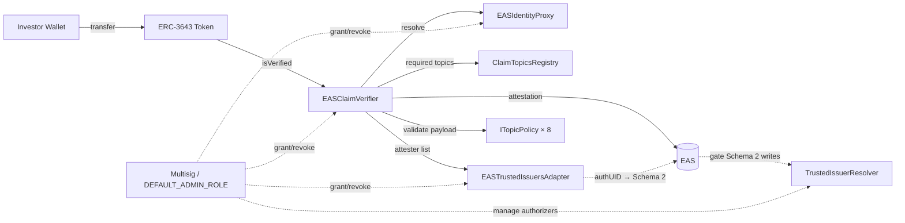
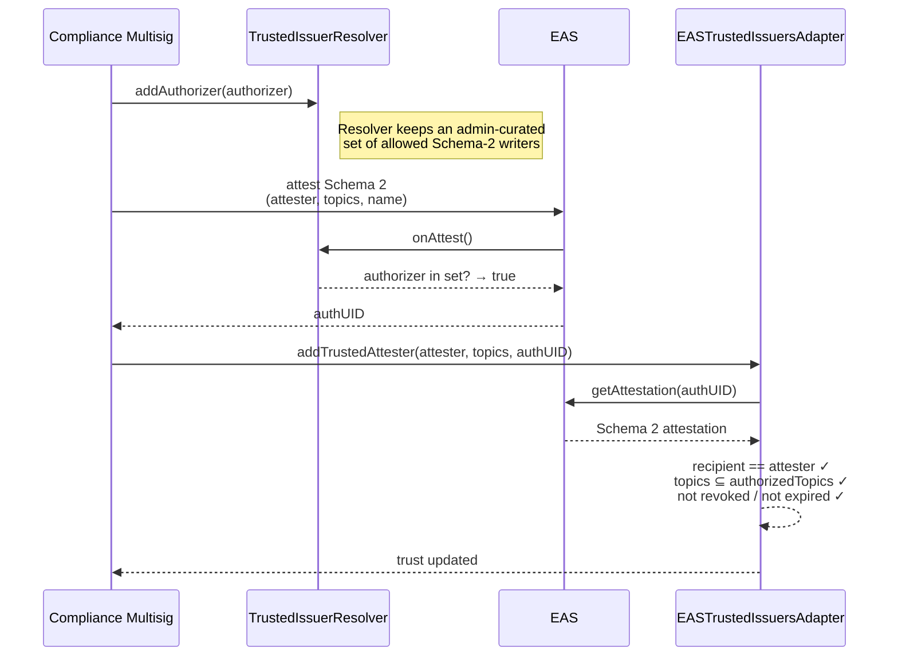

# Shibui (EAS ↔ ERC-3643)

**Shibui is an attestation retrieval adapter for ERC-3643 identity verification** — it answers one question, authoritatively, for a token contract's compliance hook: *"Does this wallet hold the attestations my issuer requires, with current payloads, right now?"*

It is not a full identity layer. Token-side enforcement primitives (forced transfer, freeze, recovery) remain the ERC-3643 token contract's responsibility. See [`docs/architecture/enforcement-boundary.md`](docs/architecture/enforcement-boundary.md).

> An open-source project by the [Enterprise Ethereum Alliance](https://entethalliance.org)

## What changed (post audit refactor)

The codebase was refactored to address a structured audit (findings C-1 through C-7 and R-1, R-3, R-5, R-6, merged in [PR #54](https://github.com/EntEthAlliance/rnd-rwa-erc3643-eas/pull/54)). Key shifts:

- **Verification is now payload-aware.** `isVerified()` invokes an `ITopicPolicy` module per required topic. A KYC attestation with `kycStatus = PENDING` no longer passes Topic 1; an accreditation attestation with `accreditationType = NONE` no longer passes Topic 7.
- **No single-slot attestation cache.** `_verifyTopic` iterates the trusted-attester list for the topic (≤ 5 per topic) so removing one compromised provider does not invalidate investors covered by other trusted providers.
- **`addTrustedAttester` is Schema-2-gated.** Every trust change must reference a live EAS Schema-2 (Issuer Authorization) attestation whose `recipient == attester` and whose `authorizedTopics ⊇ requested topics`. The Schema-2 resolver gates who can issue these attestations in the first place.
- **Admin surface is `AccessControl`-based.** `Ownable` is gone; production deploys put `DEFAULT_ADMIN_ROLE` behind a multisig.
- **Identity is always proxied.** The `wallet == identity` fallback is removed; `setIdentityProxy(0)` reverts.
- **Schema v2 carries evidence fields.** `evidenceHash` and `verificationMethod` are part of Schema 1 v2, so examiners can trace an eligibility decision back to its supporting KYC file.
- **Wrapper is a read-compat shim, not a drop-in.** `EASClaimVerifierIdentityWrapper` is explicitly documented as not implementing ERC-734 keys, recovery, or signature verification.

## Architecture



### How a single `isVerified(wallet)` call resolves

1. **Resolve identity.** `verifier._identityProxy.getIdentity(wallet)` returns the investor's identity address. If no proxy is configured the call reverts — there is no implicit "wallet is its own identity" fallback.
2. **Enumerate required topics.** `verifier._claimTopicsRegistry.getClaimTopics()` returns the set the token issuer declared required.
3. **For each topic**, the verifier:
   - Looks up the bound `ITopicPolicy` (e.g. `KYCStatusPolicy` for topic 1). If none, verification reverts with `PolicyNotConfiguredForTopic`.
   - Looks up the bound EAS schema UID.
   - Iterates the trusted-attester list for the topic (capped at `MAX_ATTESTERS_PER_TOPIC = 5`).
   - For each attester, fetches the attestation registered for `(identity, topic, attester)`, verifies the attestation is live (exists, schema matches, not revoked, EAS `expirationTime` current, attester still trusted), and calls `policy.validate(attestation)` to enforce the payload rule.
   - As soon as one attester's attestation satisfies both the structural checks and the policy, the topic is considered satisfied.
4. **Return true** only if every required topic was satisfied.

### Schema-2 gate (audit fix C-5)



## Repository layout

```
contracts/
├─ EASClaimVerifier.sol              — payload-aware verifier (AccessControl)
├─ EASTrustedIssuersAdapter.sol      — Schema-2-gated trusted-attester registry
├─ EASIdentityProxy.sol              — wallet ↔ identity binding (AGENT_ROLE)
├─ EASClaimVerifierIdentityWrapper.sol — read-compat shim for legacy ERC-3643 (Path B)
├─ interfaces/                       — IEASClaimVerifier, IEASTrustedIssuersAdapter, …
├─ policies/
│  ├─ ITopicPolicy.sol                — single-method predicate interface
│  ├─ TopicPolicyBase.sol             — shared Schema-v2 decoder
│  ├─ KYCStatusPolicy.sol             — Topic 1
│  ├─ AMLPolicy.sol                   — Topic 2
│  ├─ CountryAllowListPolicy.sol      — Topic 3 (admin-configurable allow/block)
│  ├─ AccreditationPolicy.sol         — Topic 7 (admin-configurable allow-list)
│  ├─ ProfessionalInvestorPolicy.sol  — Topic 9 (MiFID II)
│  ├─ InstitutionalInvestorPolicy.sol — Topic 10
│  ├─ SanctionsPolicy.sol             — Topic 13 (OFAC)
│  └─ SourceOfFundsPolicy.sol         — Topic 14
├─ resolvers/
│  └─ TrustedIssuerResolver.sol       — gates Schema-2 writes
├─ upgradeable/                        — UUPS variants of the three core contracts
└─ mocks/                              — MockEAS, MockAttester, MockClaimTopicsRegistry

script/
├─ DeployMainnet.s.sol                 — gated deploy; multisig receives all admin roles
├─ DeployTestnet.s.sol                 — Sepolia / Base Sepolia
├─ DeployUpgradeable.s.sol             — UUPS deploy
├─ DeployBridge.s.sol                  — non-upgradeable reference deploy
├─ DeployIdentityWrapper.s.sol         — per-identity Path B wrapper
├─ RegisterSchemas.s.sol               — register Schema 1 v2 + Schema 2 (with resolver)
├─ ConfigureBridge.s.sol               — idempotent topic-schema & topic-policy wiring
├─ AddTrustedAttester.s.sol            — CLI helper; requires AUTH_UID
└─ SetupPilot.s.sol                    — local anvil pilot with 5 seeded investors

test/
├─ helpers/BridgeHarness.sol           — deploys + wires the full stack for each test
├─ unit/                               — per-contract unit tests + policy suite
├─ integration/                        — revocation, dual-mode, policy-driven verification
└─ scenarios/                          — Reg D, Reg S, MiFID II, OFAC end-to-end flows

docs/
├─ architecture/
│  ├─ enforcement-boundary.md          — what Shibui does NOT provide (start here)
│  ├─ identity-architecture-explained.md
│  └─ system-architecture.md
├─ schemas/schema-definitions.md       — Schema 1 v2 spec
├─ research/gap-analysis.md            — ONCHAINID vs EAS comparison
└─ integration-guide.md                — Path A & Path B integration
```

## Claim topics and policies

| Topic ID | Name | Policy | What it enforces |
|---:|---|---|---|
| 1 | KYC | `KYCStatusPolicy` | `kycStatus == VERIFIED` |
| 2 | AML | `AMLPolicy` | `amlStatus == CLEAR` |
| 3 | COUNTRY | `CountryAllowListPolicy` | country in allow-list (or not in block-list) |
| 7 | ACCREDITATION | `AccreditationPolicy` | accreditation type in admin-configured allow-list |
| 9 | PROFESSIONAL | `ProfessionalInvestorPolicy` | any non-zero accreditation type (MiFID II) |
| 10 | INSTITUTIONAL | `InstitutionalInvestorPolicy` | `accreditationType == INSTITUTIONAL` |
| 13 | SANCTIONS_CHECK | `SanctionsPolicy` | `sanctionsStatus == CLEAR` |
| 14 | SOURCE_OF_FUNDS | `SourceOfFundsPolicy` | `sourceOfFundsStatus == VERIFIED` |

All eight read the same Schema 1 v2 payload:

```
address identity, uint8 kycStatus, uint8 amlStatus, uint8 sanctionsStatus,
uint8 sourceOfFundsStatus, uint8 accreditationType, uint16 countryCode,
uint64 expirationTimestamp, bytes32 evidenceHash, uint8 verificationMethod
```

## Administration

All core contracts use OpenZeppelin `AccessControl`:

| Role | Granted to | Surface |
|---|---|---|
| `DEFAULT_ADMIN_ROLE` | **Multisig (production)** | Grant/revoke other roles; `_authorizeUpgrade` on UUPS variants; set Issuer Authorization schema UID on adapter |
| `OPERATOR_ROLE` | Day-to-day operators | Topic-schema mapping, topic-policy mapping, trusted-attester changes |
| `AGENT_ROLE` | Issuer agents | Wallet ↔ identity binding in `EASIdentityProxy` |

No timelock is applied by default; the multisig is the control plane. Deployers transfer `DEFAULT_ADMIN_ROLE` to the multisig and renounce their own grant atomically in `DeployMainnet.s.sol`.

## Out of scope

The following live in the ERC-3643 **token contract** (or in off-chain tooling), not in Shibui, and revoking a Shibui attestation is not a substitute for them:

- Forced transfer (court orders)
- Account freeze / partial freeze (sanctions)
- Lost-key recovery
- Lock-up schedules, per-investor caps, ownership limits
- Cross-chain attestation canonicity — EAS attestations are per-chain today; multi-chain portability is on the V2 roadmap
- Off-chain attestation verification — deferred to V2
- Tax withholding / FATCA-CRS reporting

## Quickstart

```bash
forge install
forge build
forge test            # 71 tests passing
```

### Local pilot (anvil)

```bash
anvil
forge script script/SetupPilot.s.sol:SetupPilot \
  --rpc-url http://127.0.0.1:8545 \
  --broadcast
```

The pilot deploys MockEAS, the full Shibui stack (all 8 policies + resolver + Schema-2 authorizer), seeds five investors with Schema v2 attestations, and prints `isVerified()` for each.

### Testnet / mainnet deploy

```bash
# testnet (Sepolia / Base Sepolia)
PRIVATE_KEY=... ADMIN_ADDRESS=0x... \
  forge script script/DeployTestnet.s.sol:DeployTestnet --rpc-url $RPC --broadcast

# register schemas (prints new UIDs)
ISSUER_AUTH_RESOLVER=<TrustedIssuerResolver from above> PRIVATE_KEY=... \
  forge script script/RegisterSchemas.s.sol:RegisterSchemas --rpc-url $RPC --broadcast

# wire schema UIDs and policies
VERIFIER_ADDRESS=... ADAPTER_ADDRESS=... \
INVESTOR_ELIGIBILITY_SCHEMA_UID=0x... \
ISSUER_AUTHORIZATION_SCHEMA_UID=0x... \
KYC_POLICY=0x... AML_POLICY=0x... …  \
  forge script script/ConfigureBridge.s.sol:ConfigureBridge --rpc-url $RPC --broadcast

# add trusted attester (requires AUTH_UID from a Schema-2 attestation)
ADAPTER_ADDRESS=... ATTESTER_ADDRESS=0x... TOPICS="1,3,7" AUTH_UID=0x... \
  forge script script/AddTrustedAttester.s.sol:AddTrustedAttester --rpc-url $RPC --broadcast

# mainnet: gated by AUDIT_ACKNOWLEDGED=true and MULTISIG_ADDRESS
AUDIT_ACKNOWLEDGED=true PRIVATE_KEY=... MULTISIG_ADDRESS=0x... CLAIM_TOPICS_REGISTRY=0x... \
  forge script script/DeployMainnet.s.sol:DeployMainnet --rpc-url $RPC --broadcast
```

## Live website

- Landing page: https://entethalliance.github.io/rnd-rwa-erc3643-eas/
- Identity Management Solutions reference map: https://entethalliance.github.io/rnd-rwa-erc3643-eas/identity-solutions-map.html

## Security

- Independent audit of the refactored contracts is required before mainnet. The refactor in #54 addressed audit findings C-1 through C-7 and R-1/R-3/R-5/R-6, but a fresh pass on the new surface area (policies, resolver, Schema-2 gate) is a prerequisite.
- Mainnet deploy script refuses to broadcast unless `AUDIT_ACKNOWLEDGED=true` is set (see [`AUDIT.md`](AUDIT.md)).

## Documentation

Start with:

- [`docs/architecture/enforcement-boundary.md`](docs/architecture/enforcement-boundary.md) — scope boundaries
- [`docs/architecture/identity-architecture-explained.md`](docs/architecture/identity-architecture-explained.md) — architectural walkthrough
- [`docs/integration-guide.md`](docs/integration-guide.md) — Path A and Path B integration
- [`docs/schemas/schema-definitions.md`](docs/schemas/schema-definitions.md) — Schema 1 v2 spec
- [`AUDIT.md`](AUDIT.md) — threat model and mainnet launch gates
- [`PRD.md`](PRD.md) — MVP scope and acceptance criteria
- [`docs/research/gap-analysis.md`](docs/research/gap-analysis.md) — ONCHAINID vs EAS comparison

## License

MIT
