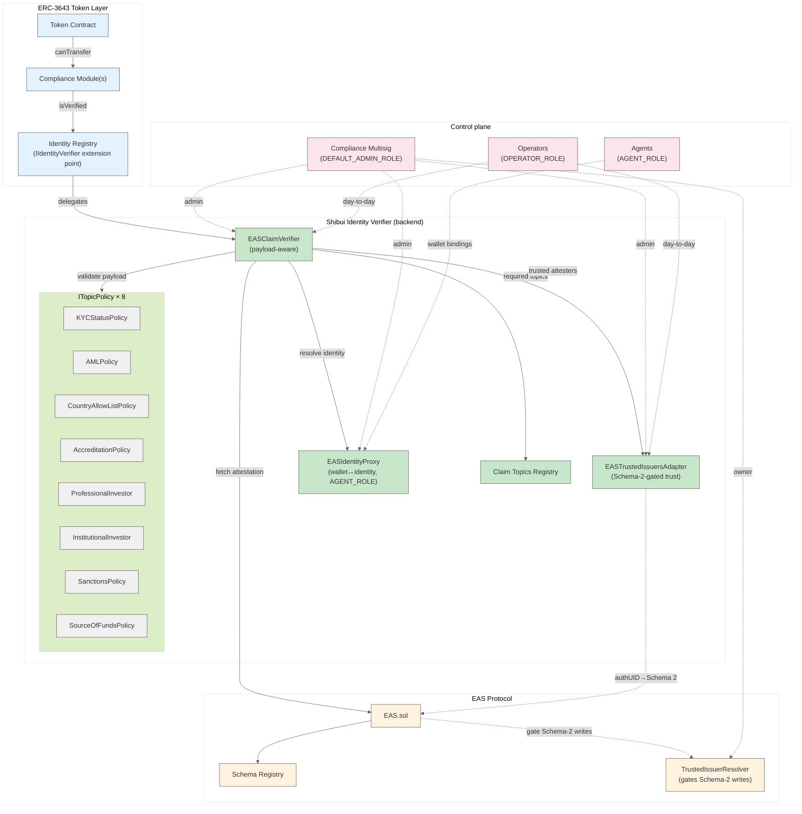
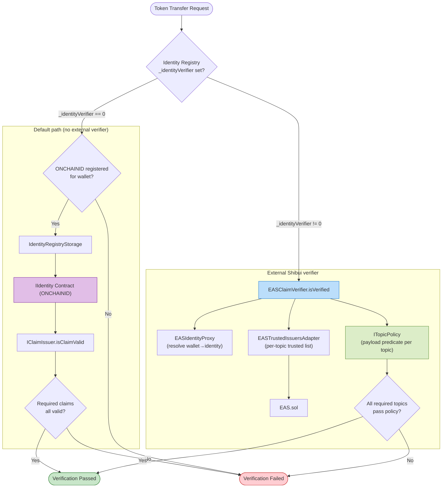
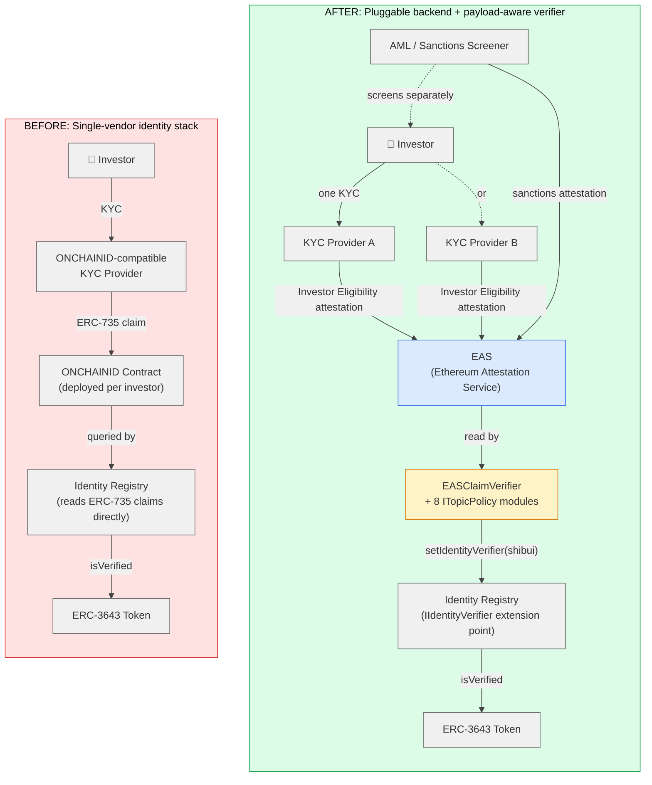
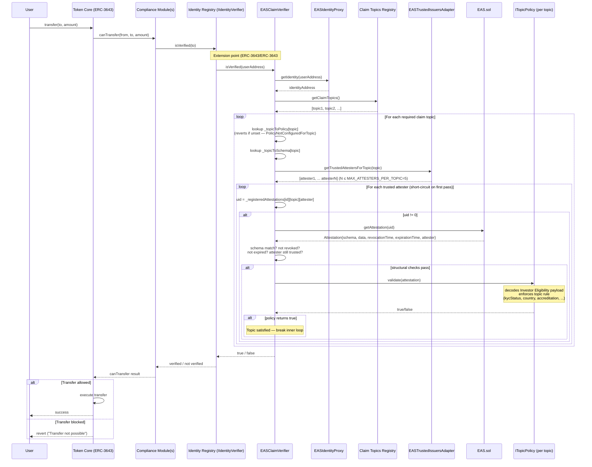
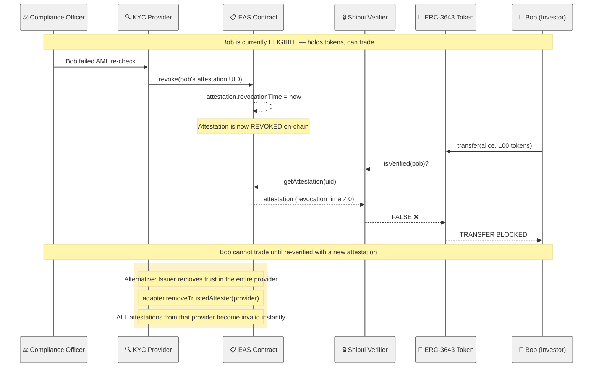
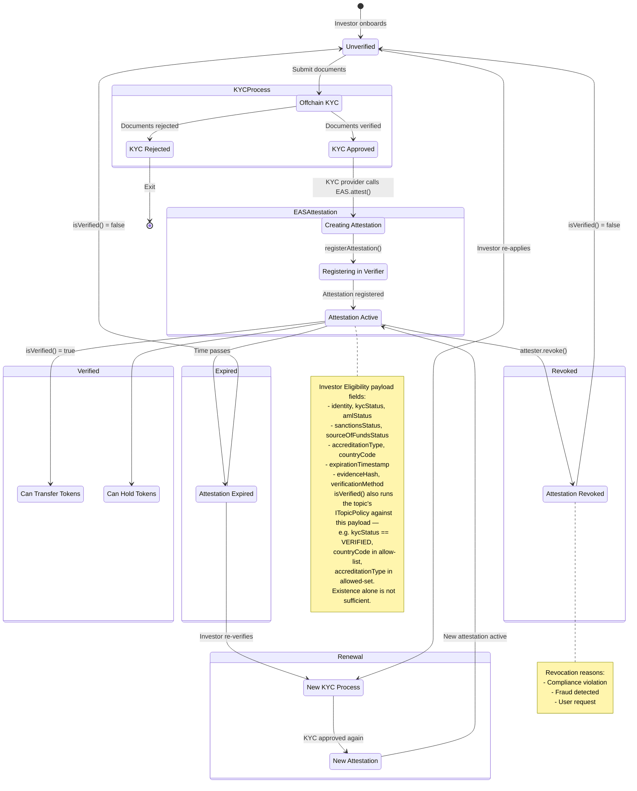
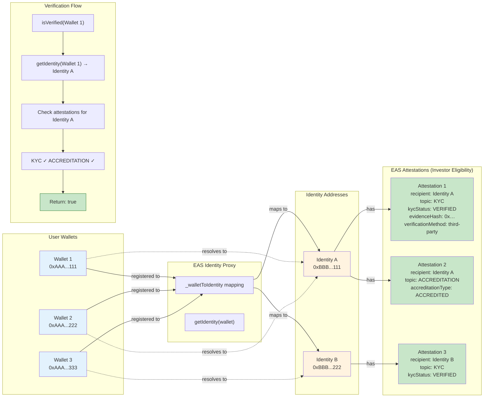
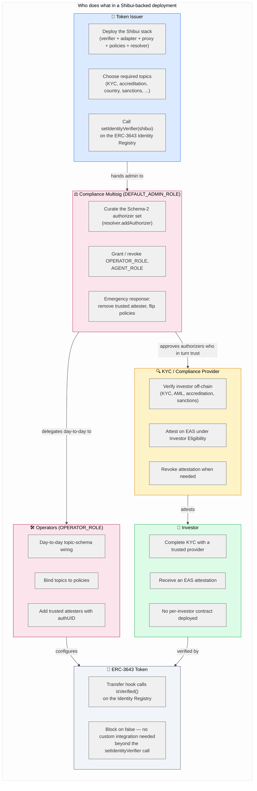
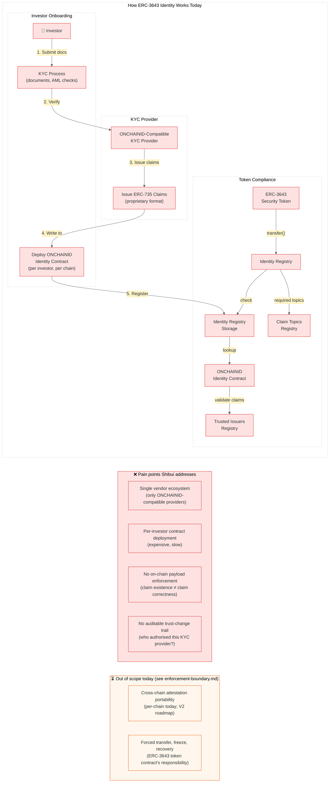

# Diagrams

Mermaid source files (`.mmd`) explaining Shibui's current architecture (post audit refactor, v0.4.x).

The diagrams are rendered inline below. Source `.mmd` files live in this directory.

---

## Architecture — what lives where and who controls it

### Architecture overview

Full component + control plane (token, verifier, policies × 8, adapter, resolver, proxy, multisig). Source: [`architecture-overview.mmd`](architecture-overview.mmd).

### Pluggable backend verification

`IIdentityVerifier` extension point in the ERC-3643 Identity Registry: either the default ONCHAINID path runs, or Shibui runs. Delegation is total, not hybrid. Source: [`pluggable-backend-verification.mmd`](pluggable-backend-verification.mmd).

### Shibui — before / after

Single-vendor identity stack vs. pluggable backend with payload-aware verification. Source: [`shibui-before-after.mmd`](shibui-before-after.mmd).

---

## Behavioural flows — what happens on a transfer / revocation

### Transfer verification flow

Sequence from `token.transfer` through compliance → Identity Registry → `EASClaimVerifier` → per-topic `ITopicPolicy.validate`. Source: [`transfer-verification-flow.mmd`](transfer-verification-flow.mmd).

### Revocation flow

Attester revokes on EAS → next `isVerified` returns false → transfer blocked. Source: [`revocation-flow.mmd`](revocation-flow.mmd).

### Attestation lifecycle

State machine from unverified → active → revoked / expired → renewed. Includes Investor Eligibility payload fields. Source: [`attestation-lifecycle.mmd`](attestation-lifecycle.mmd).

### Wallet ↔ identity mapping

How multiple wallets resolve to a single identity in `EASIdentityProxy`. Source: [`wallet-identity-mapping.mmd`](wallet-identity-mapping.mmd).

---

## People / roles

### Stakeholder interactions

Token issuer, compliance multisig (DEFAULT_ADMIN_ROLE), operators (OPERATOR_ROLE), agents (AGENT_ROLE), KYC providers, investors, token contract. Source: [`stakeholder-interactions.mmd`](stakeholder-interactions.mmd).

---

## Legacy baseline (for contrast)

### Current ERC-3643 identity

How ERC-3643 identity works with ONCHAINID alone, which pain points Shibui addresses, and which it explicitly does not. Source: [`current-erc3643-identity.mmd`](current-erc3643-identity.mmd).

---

## Rendering

GitHub renders the `mermaid` code blocks above inline. To edit the raw sources, open the linked `.mmd` files directly — viewers such as [Mermaid Live Editor](https://mermaid.live/) or the VS Code *Mermaid Preview* extension render them standalone.

## Scope note

Diagrams match the **v0.4** production path. The core is targeted at EthTrust SL Level 2 (see `AUDIT.md`); the Path-B wrapper under `contracts/compat/` is Level 1 and not the subject of these diagrams. Older exploratory Valence/Diamond work is archived on branch `research/valence-spike`.
